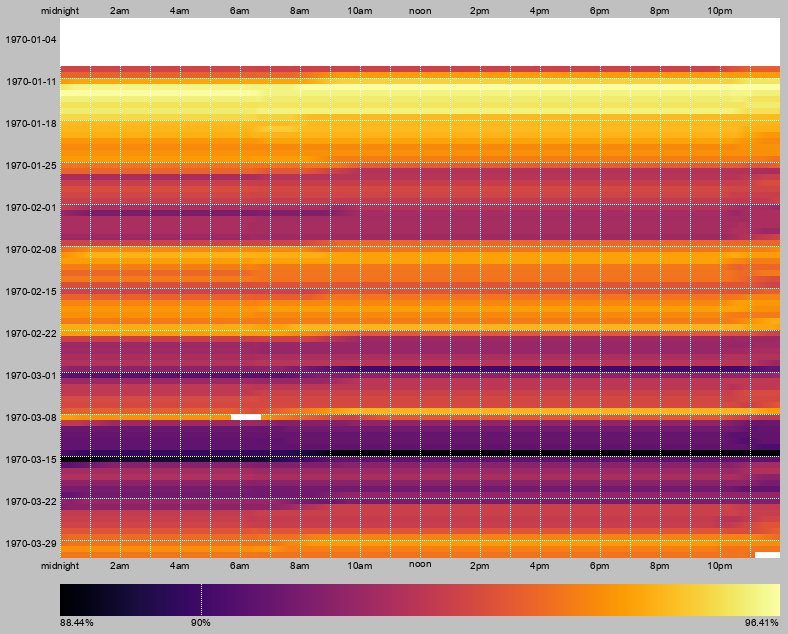

# Lamp History

A system for controlling lamps from buttons placed strategically around a room
(next to your bed, for example), and displaying a history of when they are *on*
and *off* as a rough proxy for sleep data.


## Setup

[`lamps.py`](lamps.py) runs on a Raspberry Pi, connected to push buttons and an
[IoT Power Relay](https://dlidirect.com/products/iot-power-relay). Pushing a
button toggles the relay and records the event to `history.txt`.


## History Chart

[`render.py`](render.py) produces a series of charts based on the `history.txt`
output by `lamps.py`.

```txt
usage: render.py [-h] [-f MIN] [-lat LAT] [-lon LON] [-tz TZ] outfolder infiles...

options:
  -h, --help            show this help message and exit
  -f MIN, --filter MIN  ignore segments shorter than MIN minutes long

files:
  outfolder             directory to output generated charts and plots
  infiles               history file(s) to read

sunrise and sunset:
  Specify all three of these arguments to add sunrise and sunset markers to the history chart

  -lat LAT              latitude in degrees north
  -lon LON              longitude in degrees east
  -tz TZ                timezone name, e.g., "America/Los_Angeles"

With no files specified, arguments are read from 'input.txt'
```

### History

`history.png` is a raw representation of when the lamps were *on* or *off*. Each
horizontal strip represents one day, from midnight to midnight. The chart has
horizontal gridlines dividing weeks (Sunday-Saturday), and vertical gridlines
dividing hours in each day. The date of each Sunday is labeled on the left side,
as well as every other hour on the top and bottom. White regions represent when
the lamps were *on*, and black regions when they were *off*.

This is an example `history.png` showing 90 days of artificial data:


### Trend

The `trend_*.png` files show the same data, but presented differently. The chart
layout is the same as `history.png`, but the color at each location represents
the average time the lamps have been *on* per day in the specified previous
interval (1, 7, 14, and 30 days for `daily`, `weekly`, `fortnightly`, and
`monthly` respectively). The scale at the bottom shows how much time per day
each color represents. Lighter colors mean more time *on*, and darker colors
mean more time *off*. Note that the scale is different for each chart.

This is an example `trend_weekly.png` showing the same 90 days of artificial
data (note the blank space at the top of the chart, because it has not yet been
a week since the start of the data, so there isn't a valid weekly average for
those times):


### Cohesion

Cohesion is a measure of how similar the *on* and *off* patterns are day-to-day,
or in other words, how consistent your sleep schedule is. The cohesion value for
a given time is calculated by how often, over the pervious interval, the lamp
state (*on* or *off*) was the same as it was 24 hours before. 100% cohesion
means that the lamps switch *on* and *off* at exactly the same time each day,
and lower values mean lower amounts of overlap over the previous day. Cohesion
values are calculated in rolling windows of 1, 7, 14, and 30 days and ploted in
`cohesion_*.png` similar to trend values.

This is an example `cohesion_weekly.png` with 90 days of artificial data:



### Plots

`plots1.png`, `plots2.png`, and `plots3.png` (and their PDF versions) show
various plots of other information about the data that might be interesting
(though mostly only for real data).

In [`plots1`](example_output/plots1.png), the top two are histograms of the time
the lamps are continuously *off* or *on* (a "segment"). The bottom two are 2D
histograms of that data over time.

In [`plots2`](example_output/plots2.png), the top two show the relationship
between the lengths of adjacent segments (*off* then *on*, or *on* then *off*).
The middle two show the relationship between a segment's length and the total
time the lamps were *off* in the 24 hours prior to the segment's start. The
bottom left shows the relationship between the montly trend and the monthly
cohesion.

[`plots3`](example_output/plots3.png) shows the "trend" and "cohesion" data as
line graphs.


## Examples

[`generate_example.py`](generate_example.py) was used to generate 90 days of
random data in [`example_history.txt`](example_history.txt).
[`example_output/`](example_output) contains all of the charts based on that
data generated by `render.py`.


## Known Issues

* DST changes result in irregularities for `render.py`. The skipped hour in
spring shows up as a blank hour *after* the segment where it actually happened.
The script has no way to handle the repeated hour in fall, so some data gets
obscured.
* `render.py` splits segments that cross a day boundary (i.e., runs through
midnight) into two segments so that it can display them properly, but it assumes
that there will never be a segment that crosses more than one day boundary.
